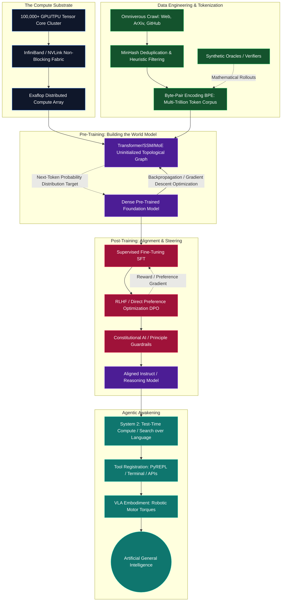

# AGI Research Library & Master Manufacturing Guide

[](https://opensource.org/licenses/MIT)
[](http://makeapullrequest.com)
[](https://react.dev)
[](https://www.typescriptlang.org/)

Welcome to the **AGI Research Library**, a highly scalable, multi-faceted portal and archive designed to track the rapidly evolving landscape of Artificial General Intelligence (AGI). This application dynamically syncs with major pre-print servers and databases (such as ArXiv and Open Library) to compile an exhaustive repository of the most influential papers, philosophical treatises, books, and frameworks driving the modern intelligence revolution.

Beyond acting as a dynamic academic portal, this document serves as a **Deep Dive Master Guide** and **Scientific Manifesto** regarding the manufacturing of Artificial General Intelligence. It extensively details the current computational paradigms, theoretical frameworks, and algorithmic breakthroughs.

---

## 🔬 Part 1: The Epistemology & Theory of AGI

**Artificial General Intelligence (AGI)** is definitively characterized as an autonomous cognitive architecture capable of outperforming the median human across a broad spectrum of economically and scientifically valuable tasks. To understand how we build it, we must first deeply understand the theoretical axioms driving the field.

### 1.1 The Bitter Lesson & The Scaling Hypothesis
Historically, AI researchers tried to build intelligence by hardcoding human knowledge (expert systems, grammatical rules). Rich Sutton's **"Bitter Lesson"** proved that human-engineered heuristics always lose in the long run to methods that leverage massive computation. The **Scaling Hypothesis** posits that intelligence is an emergent property of next-token prediction modeled over massive neural graphs. 
The mathematical underpinning is modeled by scaling laws: 
`L(N, D) = (N_c / N)^(α_N) + (D_c / D)^(α_D)`
Where the loss `L` decreases predictably as a power-law with respect to Parameter count `N` and Dataset size `D`.

### 1.2 The Core Faculties of AGI
Unlike Narrow AI, AGI sits at the intersection of several critical computational faculties:

1. **Cross-Domain Generalization & Zero-Shot Transfer:** The system's ability to abstract a concept learned in one environment (e.g., higher-order algebra) and apply it instantly to an entirely unseen, disjointed environment (e.g., fluid dynamics, poetic cadence).
2. **Meta-Learning & Neuroplasticity:** "Learning to learn." Without human curriculum intervention, an AGI must dynamically route its own gradients and internal state-spaces based on environmental feedback.
3. **Epistemic Humility & Reality Grounding:** Operating with an advanced world model that calculates its own probabilistic uncertainties (Bayesian active inference). The agent must seek external information and trigger physical or simulated experiments to resolve out-of-distribution hallucinations.
4. **Agentic System 2 Framing (Test-Time Compute):** The capacity to execute Monte Carlo Tree Search (MCTS) over language. It breaks down multi-year, multi-step goals into executable nodes, maintains a resilient internal state, and backtracks upon encountering logical dead-ends.

---

## 🏗️ Part 2: The Canonical AGI Manufacturing Pipeline

The path to synthetic intelligence relies on unprecedented engineering rigor. Here is the deep-detailed pipeline of how the world's leading intelligence laboratories manufacture frontier models.

### Architectural Blueprint representing the AGI Factory



### Step 1: The Compute Substrate (Hardware)
Intelligence at scale requires orchestrating hardware at the absolute physical limits of thermodynamics and signal processing.
*   **Silicon Topology:** Clusters encompassing hundreds of thousands of massively parallel GPUs interconnected via optical networks scaling bandwidth to multiple terabytes per second.
*   **Numerical Precision:** Utilizing FP8 and BF16 (Brain Floating Point) matrices to double throughput while avoiding gradient underflow during deep backpropagation.
*   **The Power Bottleneck:** A frontier model requires hundreds of megawatts of continuous electrical power. Intelligence is now intrinsically bound to energy proximity (nuclear, geothermal generation).

### Step 2: The Core Mechanism (Architecture)
The architecture must process practically infinite contexts mathematically.
*   **The Attention Mechanism:** The Transformer architecture parses sequential data contextually rather than chronologically. Mathematically: `Attention(Q, K, V) = softmax(QK^T / √d_k) V`. This allows the network to calculate the relational gravity of every token to every other token simultaneously.
*   **State-Space Models (SSMs):** Architectures like Mamba map discrete sequences to continuous state equations (`h'(t) = Ah(t) + Bx(t)`), seeking to bypass the `O(N^2)` quadratic compute limitations of pure attention, enabling millions-of-tokens in context.
*   **Mixture of Experts (MoE) & Routing:** To scale parameters into the trillions without halting inference, the network uses sparse gating (`G(x) = Softmax(W_g x)`). Only the top-k specialized "expert" neural networks are activated per token, making 1.5 Trillion parameter models computationally equivalent to 100 Billion parameter models at inference.

### Step 3: Lifeblood & Synthetic Data
*   **Chinchilla Scaling:** It was mathematically proven that models were vastly over-parameterized and under-trained. The optimal ratio requires ~20 training tokens per 1 parameter. A 1 Trillion parameter model requires an astronomically scrubbed 20 Trillion token dataset.
*   **The Synthesis Exhaustion Wall:** With high-quality human data (Wikipedia, ArXiv, StackOverflow) nearing total exhaustion, models bootstrap themselves. They generate complex synthetic reasoning paths, verify the logic programmatically (e.g., executing Python to check math), and append successful paths to their own training data (Recursive Self-Improvement).

### Step 4: Incubation & The Interpolative World Model
*   **Latent Space Mapping:** By minimizing the cross-entropy loss on predicting missing information across trillions of iterations, the model learns to compress reality. It does not memorize text; it constructs abstract, topological, high-dimensional manifolds of human concepts, physics, and causal logic.
*   **Mechanistic Interpretability:** Within the latent space, features exist in **Superposition**. Because the model must represent more concepts than it has neurons, concepts overlap mathematically in a polysemantic web.

### Step 5: Post-Training (Alignment)
A pre-trained base model is merely a non-deterministic simulator of the internet. It must be constrained into an agentic entity.
*   **RLHF (Reinforcement Learning from Human Feedback):** Utilizing human annotations to train a secondary "Reward Model." The base model then optimizes its outputs against this reward model using algorithms like PPO (Proximal Policy Optimization).
*   **Direct Preference Optimization (DPO):** Bypasses the discrete reward model entirely by treating the language model itself as the reward model, mathematically mapping human preference pairs directly into the LLM's cross-entropy loss function.
*   **Constitutional AI (RLAIF):** Replacing human labor with rule-based critiques where the AI evaluates its own responses against a strict declarative constitution, learning to correct itself dynamically.

### Step 6: Agentic Awakening & Test-Time Compute
The final form of AGI requires interactive closure with Reality and the ability to "think" before speaking.
*   **System-2 Processing (Search over Language):** Traditional LLMs generate tokens in a single forward pass (System 1). Agentic AGI utilizes reinforcement learning at inference time to generate a hidden "Chain of Thought", exploring thousands of potential logical trajectories, discarding dead-ends, and formulating a mathematically sound answer before outputting the final token (e.g., OpenAI's o1 architecture).
*   **Vision-Language-Action (VLA) Embodiment:** Binding multimodal perception directly to motor-torque outputs. The vast semantic world knowledge is deployed into robotic chassis (humanoids or drones) to complete physics-constrained tasks efficiently in the real world.

---

## 💻 Part 3: Utilizing the Application Codebase

The AGI Research Library hosted in this repository serves as your live dashboard, study companion, and persistent knowledge layer to track these incredible advancements. 

### Core Features:
- **Dynamic Pre-Print Synchronization:** Integrates directly with ArXiv and Open Library API endpoints to auto-fetch emerging AGI, LLM features, and reinforcement learning papers as soon as they drop.
- **On-Device Data Resilience:** Your specific curations, notes, tags, and structure maps stay local in `localStorage`, guaranteeing absolute privacy away from cloud surveillance.
- **Provider-Agnostic AI Deep Dives:** Input your API keys for Google Gemini, OpenAI, or Groq directly in the dynamic application settings. Select any paper or resource to have frontier models autonomously parse the abstract/data and generate an expert structural breakdown, extracting key engineering or philosophical insights instantly.
- **Rich Filtering & Search Mechanics:** Drill down by paradigm (Architectures, Alignment, Robotics, Foundational History), sort by year, keyword tagging, and seamlessly export your aggregated dataset as a hardened JSON backup.
- **Keyboard-First Telemetry:** Full support for `Cmd + K` search paletting to rapidly surface intelligence nodes inside your library.

### Quick Start Guide

**1. Clone & Install Dependencies:**
```bash
git clone https://github.com/yourusername/agi-research-library.git
cd agi-research-library
npm install
```

**2. Initialize Development Server:**
```bash
npm run dev
```

**3. Application Hotkeys & Navigation:**
- Press `Cmd + K` (or `Ctrl + K` on Windows) from anywhere to snap to the command palette/global search.
- Use the **Sync** action (circular arrows) near your settings to enforce an immediate poll against the ArXiv/Open Library external nodes.

---

## 🤝 Contribution Protocol

Research into generalized intelligence is collaborative by definition. We invite pull requests emphasizing:
- **Additions to Local Datasets:** Expand `src/data*.ts` modules with missing foundational textbooks, cutting-edge alignment mechanisms, or highly cited architecture papers.
- **Sync Extensions:** Add integrations for Semantic Scholar, PapersWithCode, or Hugging Face end-points.
- **Algorithmic Theory:** Expand the README to include detailed proofs for test-time compute, verification models, or novel agentic architectures.

Please deeply read our `CONTRIBUTING.md` and `CODE_OF_CONDUCT.md` prior to submitting your PR. Ensure all new components follow the Tailwind/Vite framework patterns already established.

## 📝 License

This overarching repository, application code, and manifesto are distributed under the MIT License. See `LICENSE` for more explicit legal information.

---
*Synthesized, maintained, and curated by the AGI Research Team & AI Studio Framework.*
