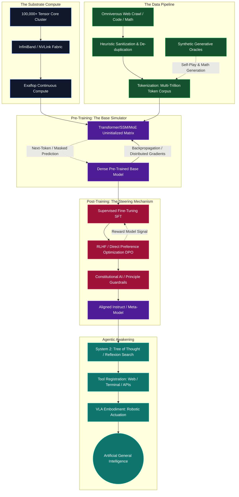

# AGI Research Library & Master Manufacturing Guide

[](https://opensource.org/licenses/MIT)
[](http://makeapullrequest.com)
[](https://react.dev)
[](https://www.typescriptlang.org/)

Welcome to the **AGI Research Library**, a highly scalable, multi-faceted portal and archive designed to track the rapidly evolving landscape of Artificial General Intelligence (AGI). This application dynamically syncs with major pre-print servers and databases (such as ArXiv and Open Library) to compile an exhaustive repository of the most influential papers, philosophical treatises, books, and frameworks driving the modern intelligence revolution.

Beyond acting as a dynamic academic portal, this document serves as a **Deep Dive Master Guide** and **Scientific Manifesto** regarding the manufacturing of Artificial General Intelligence. It extensively details the current computational paradigms, theoretical frameworks, algorithmic breakthroughs, and explores a novel post-silicon physical implementation known theoretically as **Nano Banana DNA**.

---

## 🔬 Part 1: The Epistemology of AGI – A Deep Definition

**Artificial General Intelligence (AGI)** is definitively characterized as an autonomous cognitive architecture capable of outperforming human intelligence across a broad spectrum of economically and scientifically valuable tasks. Unlike Narrow AI—which serves as a highly optimizing curve-fitting distribution machine across single domains—AGI sits at the intersection of several critical computational faculties:

1. **Cross-Domain Generalization & Zero-Shot Transfer:** The system's ability to abstract a concept learned in one environment (e.g., higher-order algebra) and apply it instantly to an entirely unseen, disjointed environment (e.g., fluid dynamics, poetic cadence, architectural design).
2. **Meta-Learning & Neuroplasticity:** Learning how to learn. An AGI must iteratively adapt its own internal optimization algorithms, evolving its weights or state-spaces based on dynamic environmental feedback without human curriculum intervention.
3. **Agentic System 2 Framing & Long-Horizon Execution:** The capacity to break down complex, multi-year, multi-step goals into executable nodes. This includes maintaining a resilient internal state, dynamically routing past failures (Tree of Thoughts), and actively interacting with software/hardware tools.
4. **Epistemic Humility & Reality Grounding:** Operating with an advanced world model that recognizes its own probabilistic uncertainties. The agent must seek external information, trigger physical or simulated experiments, and resolve hallucinations via active inference.

---

## 🏗️ Part 2: The Canonical AGI Manufacturing Pipeline (Silicon Paradigm)

The path to synthetic intelligence is paved by scaling laws combined with relentless algorithmic efficiency. To demystify the creation of AGI, we map out the rigorous process currently executed by the leading intelligence laboratories across the globe.

### Architectural Blueprint representing the AGI Factory



### Step 1: The Compute Substrate
Intelligence at scale requires hardware orchestration that pushes the boundaries of thermodynamics.
*   **Silicon Topology:** Datacenters utilizing tens to hundreds of thousands of massively parallel GPUs interconnected via optical networks scaling bandwidth to terabytes per second.
*   **The Power Bottleneck:** A frontier model requires hundreds of megawatts to gigawatts of electrical power over continuous months. Energy proximity (nuclear, geothermal) becomes fundamentally intrinsic to intelligence creation.

### Step 2: The Core Mechanism (Architecture)
*   **Transformers & State-Space Models (SSMs):** While attention mechanisms solved the bottleneck of sequence processing, newer paradigms like FlashAttention reduce hardware read/writes, and architectures like Mamba (SSMs) seek to bypass quadratic compute limitations to allow infinite context windows.
*   **Mixture of Experts (MoE):** To scale parameters into the trillions without exponentially exploding inference costs, the network uses sparse gating. Only highly specialized "expert" sub-networks are activated per token.

### Step 3: Lifeblood & Synthetic Data
*   **The Pre-training Corpus:** Trillions of tokens capturing the breadth of human thought (scientific literature, repositories of code, philosophical treaties).
*   **The Synthesis Exhaustion Wall:** With high-quality organic human data nearing exhaustion, models now bootstrap themselves via generating complex synthetic reasoning trees, verifying paths mathematically, and incorporating these back into the corpus.

### Step 4: Incubation & The World Model
*   By constantly minimizing loss on predicting missing information, the model compresses reality. It does not memorize text; it constructs profound topological maps of human concepts, physics, and logic to better predict sequences.

### Step 5: Post-Training (Alignment)
A base model acts as a neutral probabilistic simulator. It must be constrained.
*   **RLHF & DPO:** Utilizing human annotations to optimize the model toward harmless, helpful, and honest behavior. Direct Preference Optimization (DPO) and Kahneman-Tversky Optimization (KTO) further streamline this by removing the necessity of independent reward networks.
*   **Constitutional AI:** Replacing human labor with rule-based critiques where an AI evaluates its own responses against a strict declarative constitution, learning to correct itself dynamically (RLAIF).

### Step 6: Embodiment
The final form of AGI requires interactive closure with Reality.
*   **Vision-Language-Action (VLA) Models:** Binding multimodal perception to motor-torque outputs, deploying the vast semantic world knowledge into robotic chassis to complete physical tasks efficiently.

---

## 🧬 Part 3: The Exotic Horizon — The "Nano Banana DNA" Compute Architecture

*Note: The following represents a theoretical, highly experimental biomimetic shift in compute paradigm, engineered to surpass the imminent Moore’s Law plateau facing silicon and traditional photonics.*

Traditional silicon compute arrays are fundamentally planar (2D) and face extreme thermal dissipation and atomic tunneling limits. The **Nano Banana DNA** paradigm envisions a breakthrough biomimetic architecture utilizing synthetic nanotech polymers modeled on the curved geometries of biological macromolecules.

### 1. Structural Necessity: Why the "Banana" Geometry?
The "banana" morphology refers to an engineered molecular curvature composed of synthetic carbon-nanotube-protein hybrids. 
*   **3D Interlocking Matrix:** Unlike stacked flat chips, the curved macromolecules tessellate into an ultra-dense, continuously interlocked 3D double helix structure.
*   **Optimized Surface Area:** The aggressive curvature maximizes the reactive surface area required for hyper-fast localized ion exchange, enabling staggering logic gate densities without overheating limiters.

### 2. Mechanics of Computation: Potassium-Ion Superposition
Replacing binary logic gates, this substrate leverages **Potassium-Ion Mediated Superposition**.
*   **Molecular Qubits:** The electron spin states positioned within the inner radius of the "banana" molecule function as quantum bits. The physical curve naturally insulates the state from thermal decoherence, negating the need for absolute-zero cryogenics.
*   **Biomimetic Switching:** Inspired by sodium-potassium pumps in biological neurons, the Nano Banana DNA relies on an artificial potassium-ion gradient immersed in a conductive fluidic cooling gel. Computation occurs when cascading potassium ions alter the spin states across billions of molecular bridges in parallel.

### 3. Morphological Plasticity (Hardware that physically Learns)
In traditional GPUs, pathways are static, and learning occurs strictly via software weight adjustments. The Nano Banana DNA exhibits *physical morphological plasticity*.
*   As the architecture is rewarded during the alignment process, the chemical bonding along frequently utilized nano-bridges literally thickens, accelerating conductivity.
*   Unused logic branches chemically decouple and reconnect elsewhere. **The hardware reorganizes itself in real-time to identically mirror the software representation of the universe.**

### Architectural Visualization of the Nano Banana Flow

```mermaid
graph TD
    classDef bio fill:#064e3b,stroke:#10b981,stroke-width:2px,color:#fff
    classDef io fill:#1e1b4b,stroke:#6366f1,stroke-width:2px,color:#fff
    classDef flow fill:#450a0a,stroke:#f87171,stroke-width:2px,color:#fff

    subgraph System Interfacing: Digital-To-Biological
        INP[Multimodal Input<br/>Token Stream]:::io --> DAC[Nano-Laser Array<br/>Digital-to-Optical Conversion]:::io
        ADC[Spectrometric Sensor<br/>Bioluminescent Pattern Decoder]:::io --> OUT[Digital World Simulation & Output]:::io
    end

    subgraph Internal Core: Fluidic Potassium Bioreactor Matrix
        DAC -->|Photonic Modulation| HELIX_A[Alpha Strand<br/>Dynamic Quantum Context Array]:::bio
        
        subgraph Real-Time Molecular Routing (The Logic Gate)
            HELIX_A <-->|Potassium-Ion Flux Cascade| K_CHANNELS([Banana-Polymer Synaptic Bridges]):::flow
            K_CHANNELS <-->|Coherence Transfer| HELIX_B[Beta Strand<br/>Deep Latent Representation]:::bio
        end
        
        HELIX_B -.->|Photon Emission| ADC
    end

    subgraph Adaptive Morphology (Hardware Backpropagation)
        OUT -.->|Error/Reward Gradient| CTRL{Plasticity Chemical Regulator}:::io
        CTRL -.->|Enzyme Injection / Neuro-Rewiring| K_CHANNELS
        CTRL -.->|Strand Recombination| HELIX_B
    end
```

---

## 💻 Part 4: Utilizing the Application Codebase

The AGI Research Library hosted in this repository serves as your live dashboard and persistent knowledge layer to track these incredible advancements. 

### Core Features:
- **Dynamic Pre-Print Synchronization:** Integrates directly with ArXiv and Open Library API endpoints to auto-fetch emerging AGI and LLM papers.
- **On-Device Data Resilience:** Your specific curations, notes, tags, and structure maps stay local in `localStorage`, guaranteeing privacy.
- **Provider-Agnostic AI Deep Dives:** Input your API keys for Google Gemini, OpenAI, or Groq directly in the application settings. Select any paper to have the frontier models parse the abstract/data and generate an expert structural breakdown, extracting key insights instantly.
- **Rich Filtering & Export:** Drill down by paradigm (Architectures, Alignment, Robotics, Foundational History), sort by year, and seamlessly export your aggregated dataset as a hardened JSON backup.

### Quick Start Guide

**1. Clone & Install Dependencies:**
```bash
git clone https://github.com/yourusername/agi-research-library.git
cd agi-research-library
npm install
```

**2. Initialize Development Server:**
```bash
npm run dev
```

**3. Application Hotkeys & Navigation:**
- Press `Cmd + K` (or `Ctrl + K` on Windows) from anywhere to snap to the command palette/global search.
- Use the **Sync** action near your settings to enforce an immediate poll against the ArXiv/Open Library external nodes.

---

## 🤝 Contribution Protocol

Research into generalized intelligence is collaborative by definition. We invite pull requests emphasizing:
- **Additions to Local Datasets:** Expand `src/data*` modules with missing foundational textbooks, alignment mechanisms, or highly cited architecture papers.
- **Sync Extensions:** Add integrations for Semantic Scholar, PapersWithCode, or Hugging Face.
- **Hardware Theory:** Contribute expansion modules to the Bio-Compute / Nano Banana DNA documentation with detailed mathematical physics proofs.

Please read our `CONTRIBUTING.md` and `CODE_OF_CONDUCT.md` prior to submitting your PR.

## 📝 License

Distributed under the MIT License. See `LICENSE` for more information.

---
*Maintained and curated by the AGI Research Team & AI Studio Framework.*
