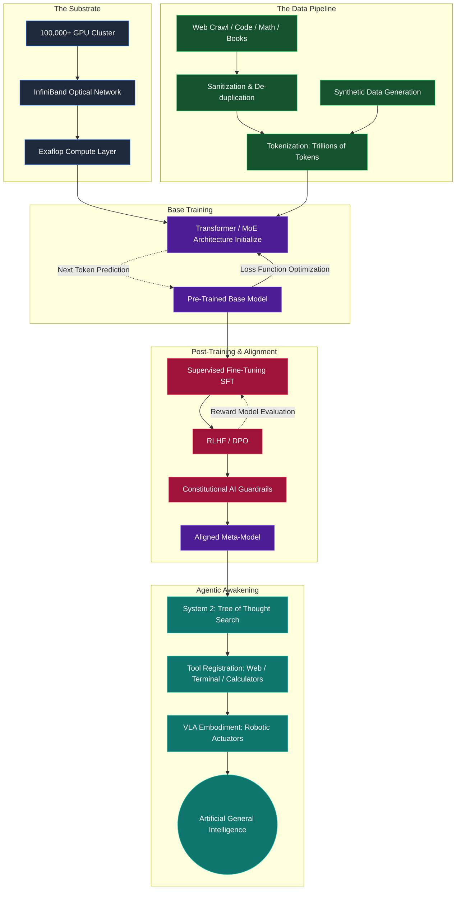
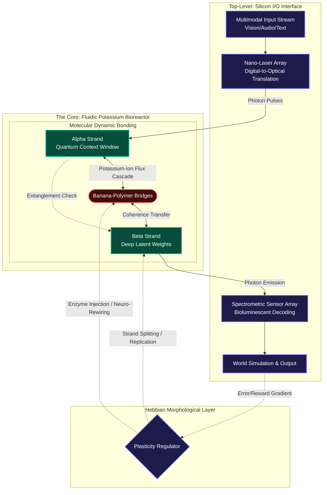
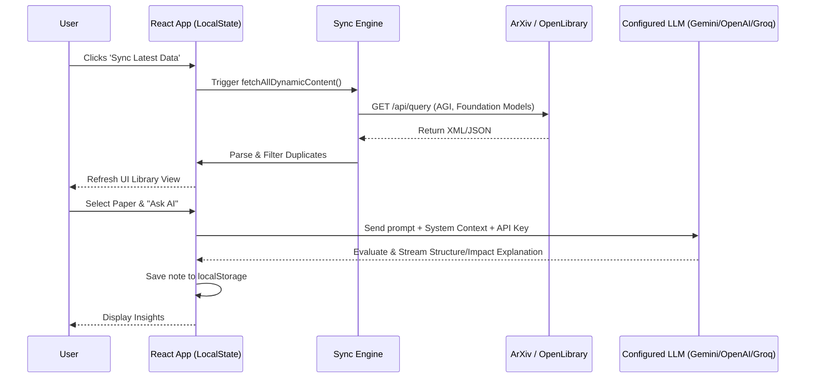

# AGI Research Library & Master Manufacturing Guide

[](https://opensource.org/licenses/MIT)
[](http://makeapullrequest.com)
[](https://react.dev)

Welcome to the **AGI Research Library**, a comprehensive portal designed to keep track of the rapidly evolving landscape of Artificial General Intelligence (AGI). This application dynamically syncs with ArXiv and Open Library to compile the latest papers, books, and resources regarding large language models, foundation models, alignment, and AGI.

Beyond being a resourceful app, this document serves as a **Deep Dive Master Guide** into the **Manufacturing of AGI**. It details the theoretical frameworks, standard paradigms, computational requirements, and a novel theoretical physical implementation known as **Nano Banana DNA**.

---

## 🧠 Part 1: What is AGI? The Deep Definition

**Artificial General Intelligence (AGI)** is defined as an autonomous system that surpasses human capabilities in the majority of economically valuable tasks. It is not just learning to play a game or generate text; it is the synthesis of:

1. **Cross-Domain Generalization:** The ability to learn a concept in one domain (e.g., mathematics) and apply it zero-shot to an entirely different domain (e.g., fluid dynamics or poetry).
2. **Meta-Learning:** Learning how to learn. An AGI must adapt its own learning algorithms based on new environments without human intervention.
3. **Agency and Long-Horizon Planning:** The capacity to break down complex, multi-year goals into actionable steps, executing them while dynamically adjusting to failures and unexpected variables.
4. **Epistemic Humility and Reality Grounding:** Knowing what it does *not* know, seeking external information via tools or experiments to resolve uncertainty.

Unlike Narrow AI, which is essentially a multidimensional curve-fitting machine finding patterns in fixed datasets, AGI requires continuous active inference, updating its internal world model in real-time.

---

## 🏗️ Part 2: How to Make AGI - The Blueprint

Manufacturing AGI is currently pursued through the paradigm of scaling laws combined with algorithmic breakthroughs. Here is the step-by-step, deep-detailed pipeline of how the world is currently trying to create AGI.

### The Standard AGI Manufacturing Pipeline (Silicon Paradigm)



### Step 1: The Compute Substrate (The Hardware)
AGI cannot run on standard consumer hardware. It requires massive, interconnected clusters operating as a single supercomputer.
*   **Silicon Topology:** Clusters of 100,000+ GPUs (like Nvidia H100s or B200s) connected via high-bandwidth optical interconnects (InfiniBand/NVLink).
*   **The Limiting Factor:** Power. Training a frontier model requires gigawatts of power, necessitating proximity to nuclear or massive renewable energy sources.

### Step 2: The Architecture (The Brain Structure)
Standard neural networks aren't enough. The architecture must handle infinite context and multimodal inputs.
*   **Transformers & State-Space Models:** The backbone of current AI is the Transformer, which uses attention mechanisms to weigh the importance of all data points simultaneously. To fix quadratic scaling limits, State-Space Models (like Mamba) are being integrated to allow infinite context windows.
*   **Mixture of Experts (MoE):** Instead of a dense network where every parameter fires for every query, MoE uses a router to send queries only to specialized "expert" sub-networks, allowing Trillions of parameters while keeping inference computationally cheap.
*   **Differentiable Memory:** Adding explicit read/write memory banks that the model can access, freeing its weights from having to memorize facts, allowing weights to focus purely on reasoning.

### Step 3: The Data (The Lifeblood)
AGI requires an accurate representation of the universe.
*   **Pre-training Data:** Trillions of tokens encompassing all public human knowledge—books, code, scientific papers, forums, and math.
*   **Multimodality:** A true world model cannot be text-only. It must process video, audio, and robotic telemetry to understand basic physics (e.g., dropping a cup makes it fall and break—a concept difficult to convey purely through text).
*   **Synthetic Data Generation:** Because we have exhausted high-quality human text, frontier models now generate their own training data (e.g., solving math problems, generating code, having a stronger model verify the logic, and training on the verified results).

### Step 4: The Training Paradigm (The Incubation)
*   **Base Training (Next-Token Prediction):** The model spends months predicting the next piece of information in a sequence. By forcing it to compress human knowledge, it naturally develops highly sophisticated internal representations (world models) of how things work.
*   **Continuous Learning:** Preventing catastrophic forgetting so that when the system learns something new, it doesn't overwrite core knowledge.

### Step 5: Alignment & Post-Training (The Steering)
An unaligned base model is an unpredictable simulator. It must be sculpted into a useful agent.
*   **RLHF (Reinforcement Learning from Human Feedback):** Humans rank the model's outputs. Another AI (a Reward Model) learns human preferences and trains the base model to maximize this reward.
*   **DPO & Kahneman-Tversky Optimization:** Direct Preference Optimization mathematically aligns models without needing a separate reward model, making alignment faster and more stable.
*   **Constitutional AI:** Giving the AI a rigid set of rules (a constitution) and having it critique and revise its own outputs during training until it complies continuously.

### Step 6: Agency and Embodiment (The Hands)
AGI must act in the world.
*   **Tool Use:** Connecting the AGI to APIs, Python interpreters, web browsers, and terminal access.
*   **System 2 Thinking:** Implementing frameworks like "Chain of Thought" or Tree of Search (e.g., AlphaCode/Q*), forcing the AI to pause, simulate multiple possible outcomes, rank them, and choose the best path before acting.
*   **Robotics (VLA Models):** Vision-Language-Action models put the brain into a robotic body, translating semantic reasoning directly into motor torque values.

---

## 🧬 Part 3: Deep Detailed Implementation of "Nano Banana DNA"

*Note: The following is a radical, highly experimental biological-quantum compute architecture conceptualized to overcome silicon limits.*

The **Nano Banana DNA** paradigm is a biomimetic compute architecture. It replaces rigid silicon wafers with synthetic nanotech polymers that structurally resemble a double helix composed of curved, banana-like macro-molecules.

### Why "Banana"? Structure Dictates Function
Silicon chips are planar (2D) and hit thermal and atomic limits. The "banana" shape refers to a specific, engineered molecular curvature of synthetic carbon-nanotube/protein hybrids.
1.  **Interlocking:** The curvature allows the molecules to interlock tightly, creating a 3D dense matrix.
2.  **Surface Area:** The curve maximizes surface area for ion exchange, which is necessary for the chemical-electrical computing mechanism.

### How Nano Banana DNA Works (The Mechanics)

Unlike traditional bits (0s and 1s) or even standard quantum qubits, Nano Banana DNA functions on **Potassium-Ion Mediated Superposition**.

1. **The Base Pairs as Qubits:**
   The artificial DNA strands are constructed from synthesized bases. Instead of holding genetic code, the electron spin state within the curve of the "banana" molecule acts as a quantum bit (qubit). The curve insulates the qubit from thermal decoherence.

2. **Ion-Gradient Compute (Biomimicry):**
   Human brains use Sodium-Potassium pumps for action potentials. This architecture uses an artificial Potassium-ion gradient suspended in a fluidic cooling gel. When a logic gate must fire, a controlled cascade of potassium ions traverses the banana-shaped bridges, triggering state changes across billions of nodes simultaneously. 

3. **Structural Plasticity (Hardware that Learns):**
   In a GPU, connections are hardwired. In the Nano Banana DNA core, the bonds between the strands are fluid. When a specific neural pathway is heavily rewarded (reinforcement learning), the chemical bonds literally thicken and strengthen (Hebbian learning at a physical level). Unused branches dissolve and reattach elsewhere. **The hardware reorganizes itself to fit the software.**

### The Manufacturing Process of Nano Banana DNA AGI

Creating this core resembles brewing a complex biological organism more than printing a circuit board.

1. **Synthesis Bioreactors:**
   The nano-polymers are synthesized in high-pressure, sterile bioreactors using precision protein-folding AI models to dictate the amino-acid sequences that form the "banana" structures.
2. **Electromagnetic Alignment:**
   The raw polymer fluid is extruded into a central core. Powerful, multi-axial magnetic fields are applied to force the polymers to self-assemble into the double-helix matrix.
3. **Potassium Encrustation & Gel Bath:**
   The matrix is submerged in the proprietary conductive fluidic gel heavily doped with Potassium ions.
4. **Digital-to-Analog Transduction Shell:**
   A spherical shell of millions of micro-lasers surrounds the biological core. Conventional silicon computers translate digital data (text, images) into optical laser pulses. These lasers hit the Nano Banana DNA, altering the chemical state. The core computes the response chemically/quantumly, and the resulting photon emissions from the core are captured by sensors and converted back into digital output.

### Deep Detailed System Architecture Graph (Mermaid Flow)



---

## 💻 Part 4: About This Application

The AGI Research Library application you are currently running is your control center for staying up-to-date with silicon-based AGI advancements while preparing for bio-compute futures.

### Core Features:
- **Dynamic Live Sync:** Automatically fetches the latest research papers from ArXiv and books from Open Library concerning AGI, LLMs, and Foundation Models. (Syncs automatically every 6 hours, or manually via the sync button).
- **AI-Powered Explanations:** Allows you to configure multiple AI providers (Google Gemini, OpenAI, Groq) using your own API keys. You can select any paper or book and ask the AI to generate a comprehensive structural overview and impact summary.
- **Local State Management:** Saves your research library, API keys, tags, and AI-generated notes locally to your browser via `localStorage` for complete privacy.
- **Backup & Import:** Export your customized knowledge base to a JSON file and import it across devices.

### Application Internal Data Flow



### Running the Project

**Install Dependencies:**
```bash
npm install
```

**Start the Development Server:**
```bash
npm run dev
```

**Using the Search:**
- Press `Cmd + K` (or `Ctrl + K` on Windows) to instantly focus the search bar.
- Use the **Sync button** next to the settings gear to pull down the latest internet data regarding AGI.

---

## 🤝 Contributing
Contributions are always welcome. Whether it's adding new theoretical nano-structures, improving the data synchronization endpoints, or simply fixing typos in the markdown:

1. Fork the Project
2. Create your Feature Branch (`git checkout -b feature/AmazingFeature`)
3. Commit your Changes (`git commit -m 'Add some AmazingFeature'`)
4. Push to the Branch (`git push origin feature/AmazingFeature`)
5. Open a Pull Request

## 📝 License
Distributed under the MIT License. See `LICENSE` for more information.

---
*Maintained by the AI Studio Agent.*
